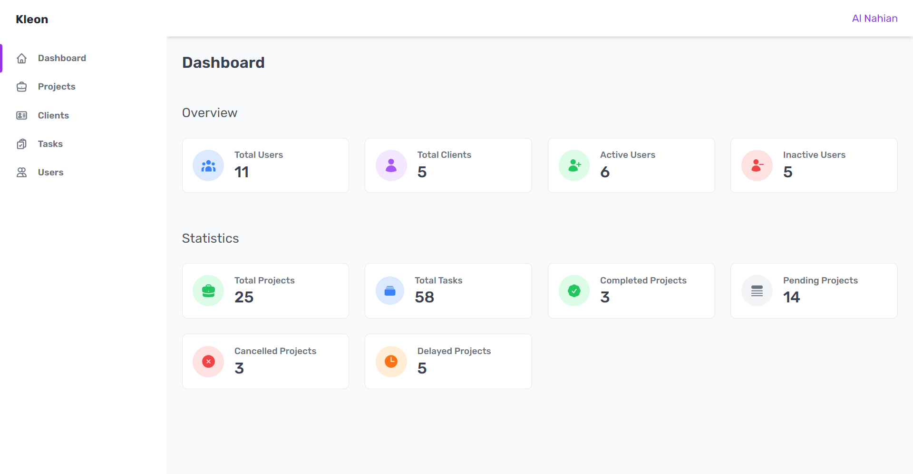
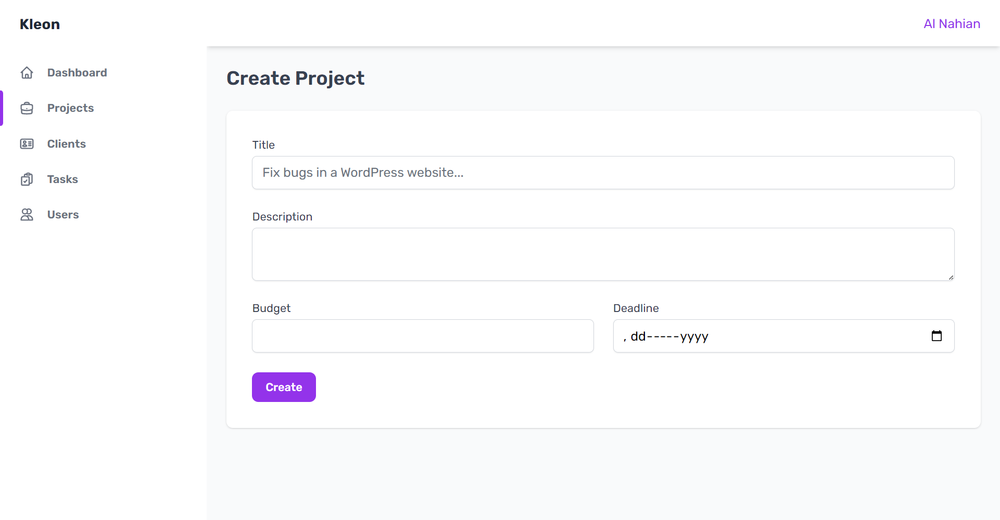
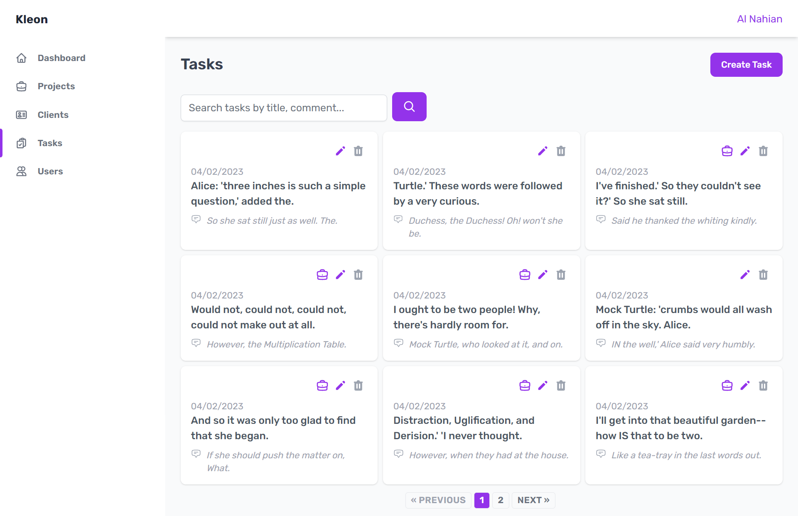

# Kleon — Freelancer CRM

Kleon is a Laravel, Vue and InertiaJS powered Freelancer CRM. Here's my submission for [**Laravel Daily**](https://github.com/LaravelDaily/)'s [_Laravel Learning Roadmap_](https://github.com/LaravelDaily/Laravel-Roadmap-Learning-Path#advanced-beginner-level) Upper Beginner level challenge.

<details>
  <summary>Screenshots</summary>

Listing of Projects


Listing of Projects


Create Project Page


Listing of Tasks


Edit Task Page


Listing of Clients


Explore this project for more!

</details>

## Features

-   Login/Register as client, create and manage projects and tasks
-   Blazing fast experience, SPA like speed.
-   Free to use forever! and many more.

## Installation

Please check the [Laravel Official Documentation](https://laravel.com/docs/master/installation) installation guide for server requirements before you start.

First, clone this repo

```bash
git clone https://github.com/alnahian2003/kleon.git
```

Switch to the repo folder

```bash
cd kleon
```

Install all the dependencies using composer and npm

```bash
composer install
```

```bash
npm install
```

Copy the `.env.example` file and make the required configuration changes in the .env file

```bash
cp .env.example .env
```

Generate a new application key

```bash
php artisan key:generate
```

Create an SQLite database. You can also use another database (MySQL, Postgres), simply update your configuration accordingly.

```bash
touch database/database.sqlite
```

Run the database migrations (Set the database connection in .env before migrating)

```bash
php artisan migrate --seed
```

Start the local development server

```bash
php artisan serve
```

Start Vite for bundling the assets or Hot Module Reload (required)

```bash
npm run dev
```

**You can now access the server at http://localhost:8000.**

### TL;DR

All the command list

```bash
git clone https://github.com/alnahian2003/kleon.git
```

```bash
cd kleon
```

```bash
composer install
```

```bash
npm install
```

```bash
cp .env.example .env
```

```bash
php artisan key:generate
```

```bash
touch database/database.sqlite
```

```bash
php artisan migrate --seed
```

```bash
php artisan serve
```

```bash
npm run dev
```

## Database Seeding (Optional)

Populate the database with seed data that includes relationships. This can help you to quickly get started and explore inside & out of this project.

Run the database seeder, and this will do it!

```bash
php artisan db:seed
```

Note : It's recommended to have a clean database before seeding. You can refresh your migrations at any point to clean the database by running the following command

```bash
php artisan migrate:refresh
```

## Tech Stack

**Client Side:** TailwindCSS, Vue

**Server Side:** Laravel

**Adapter:** Inertia

**Database:** Sqlite 3, MySql

## Note

notes

## Support

For support, [contact me](https://alnahian2003.github.io#contact) or pull an issue. Feel free to submit PR. Cheers 🥂
